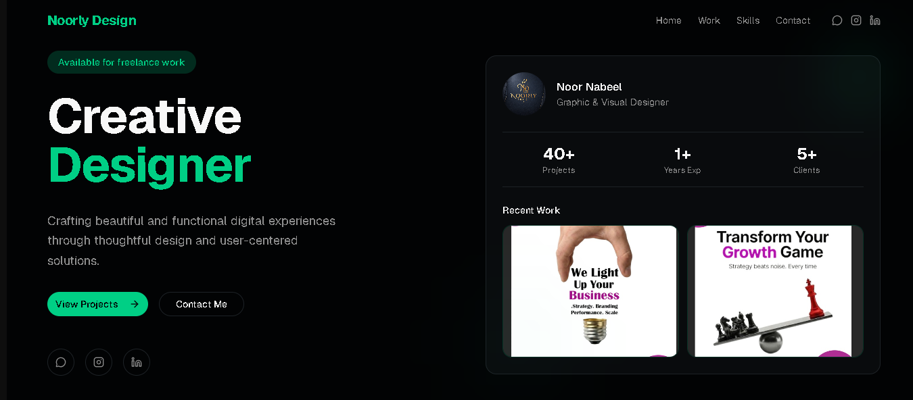

# Noorly Design Portfolio

A modern personal portfolio built with Next.js App Router, Tailwind CSS v4, and reusable UI primitives. It showcases creative work, skills, and contact channels, and includes an admin page intended for updating portfolio items.


## Table of Contents

- [Noorly Design Portfolio](#noorly-design-portfolio)
  - [Table of Contents](#table-of-contents)
  - [Overview](#overview)
  - [Features](#features)
  - [Tech Stack](#tech-stack)
  - [Project Structure](#project-structure)
  - [Getting Started](#getting-started)
    - [1. Prerequisites](#1-prerequisites)
    - [2. Install Dependencies](#2-install-dependencies)
    - [3. Prepare Data File](#3-prepare-data-file)
    - [4. Configure Environment Variables](#4-configure-environment-variables)
    - [5. Run Development Server](#5-run-development-server)
  - [Environment Variables](#environment-variables)
  - [Available Scripts](#available-scripts)
  - [How the Portfolio Data Flow Works](#how-the-portfolio-data-flow-works)
  - [Admin Panel Workflow](#admin-panel-workflow)
  - [Customization Guide](#customization-guide)
    - [Branding and Identity](#branding-and-identity)
    - [Colors and Theme](#colors-and-theme)
    - [Hero and Skills Content](#hero-and-skills-content)
    - [Work Items](#work-items)
  - [Deployment](#deployment)
    - [Vercel (Recommended)](#vercel-recommended)
  - [Troubleshooting](#troubleshooting)
    - [Work section shows no projects](#work-section-shows-no-projects)
    - [Admin page does not load existing projects](#admin-page-does-not-load-existing-projects)
    - [Admin save fails with GitHub errors](#admin-save-fails-with-github-errors)
    - [Build succeeds despite TypeScript issues](#build-succeeds-despite-typescript-issues)
  - [Known Gaps and Improvements](#known-gaps-and-improvements)
  - [Credits](#credits)

## Overview

This project is designed as a single-page portfolio experience with clear sections:

- Hero
- Work gallery
- Skills grid
- Contact links
- Footer

The homepage is assembled in `app/page.tsx` using modular components from `components/`. Styling is theme-driven through CSS variables in `app/globals.css`.

## Features

- Responsive, mobile-friendly one-page portfolio layout
- Smooth section navigation through anchor links (`#home`, `#work`, `#skills`, `#contact`)
- Reusable component architecture
- Skill cards with icon-based visual language
- Social and direct contact links (WhatsApp, Instagram, LinkedIn)
- Server-rendered Work section that reads projects from local JSON
- Admin page (`/admin`) for creating project entries (title, description, category, image)
- API route intended to persist project updates to GitHub via REST API
- Vercel Analytics integration

## Tech Stack

- Framework: Next.js 16 (App Router)
- Language: TypeScript + JavaScript (mixed)
- UI: React 19
- Styling: Tailwind CSS v4 + `tw-animate-css`
- Components: Radix UI primitives + `class-variance-authority`
- Icons: Lucide React
- Theming utilities available: `next-themes` (provider exists)
- Deployment target: Vercel-friendly

## Project Structure

```text
app/
	page.tsx                         # Homepage composition
	layout.tsx                       # Global metadata + analytics
	globals.css                      # Theme tokens + base styles
	admin/page.js                    # Admin interface for project management
	api/save-projects/route.js       # API route for GitHub content updates (POST)

components/
	navbar.tsx
	hero-section.tsx
	work-section.tsx                 # Reads from data/projects.json on server side
	skills-section.tsx
	contact-section.tsx
	footer.tsx
	ui/*                             # Reusable UI primitives

lib/
	utils.ts
	projects.json                    # Legacy/incomplete JSON file (not current source)

public/
	portfolio/                       # Static images (logo + examples)

data/
	projects.json                    # Expected runtime source for portfolio gallery
```

## Getting Started

### 1. Prerequisites

- Node.js 20+
- npm (or pnpm/yarn)

### 2. Install Dependencies

```bash
npm install
```

### 3. Prepare Data File

The Work section expects `data/projects.json`.

If it does not exist, create it with:

```json
[]
```

Then add project objects like:

```json
[
	{
		"title": "Brand Identity System",
		"description": "Logo suite and social templates for a startup",
		"category": "Branding",
		"image": "/portfolio/7.jpeg"
	}
]
```

### 4. Configure Environment Variables

Create `.env.local` in the project root:

```bash
GITHUB_REPO=OWNER/REPO_NAME
GITHUB_TOKEN=YOUR_GITHUB_TOKEN
```

### 5. Run Development Server

```bash
npm run dev
```

Open `http://localhost:3000`.

## Environment Variables

| Variable | Required | Purpose |
|---|---|---|
| `GITHUB_REPO` | Yes (for admin save) | Repository in `owner/name` format used by the API route |
| `GITHUB_TOKEN` | Yes (for admin save) | GitHub token used to read/write `data/projects.json` via API |

Token recommendations:

- Use the minimum required permissions for repository contents updates.
- Do not commit `.env.local`.
- Rotate tokens periodically.

## Available Scripts

```bash
npm run dev      # Start local dev server
npm run build    # Production build
npm run start    # Run production server
npm run lint     # Run ESLint
```

## How the Portfolio Data Flow Works

1. `components/work-section.tsx` runs on the server.
2. It reads from `data/projects.json` using `fs/promises`.
3. Parsed items are rendered into gallery cards.
4. If no data exists, a fallback empty-state message is shown.

Data model expected by `WorkSection`:

```ts
type PortfolioItem = {
	title?: string
	description?: string
	category?: string
	image: string
}
```

## Admin Panel Workflow

Path: `/admin`

Current behavior:

- Loads current project list by calling `/api/save-projects`.
- Lets the user add title, description, optional category.
- Accepts image upload (converted to Base64) or image URL.
- Sends full updated list via `POST /api/save-projects`.

API route behavior (`app/api/save-projects/route.js`):

- Reads `data/projects.json` from GitHub repository contents API.
- Encodes updated list as base64.
- Writes file back using GitHub `PUT /contents` endpoint with a commit message.

## Customization Guide

### Branding and Identity

- Update brand name and social links in:
	- `components/navbar.tsx`
	- `components/footer.tsx`
	- `components/hero-section.tsx`
	- `components/contact-section.tsx`

### Colors and Theme

- Modify CSS tokens in `app/globals.css` (`--primary`, `--background`, etc.).

### Hero and Skills Content

- Hero copy and metrics: `components/hero-section.tsx`
- Skills list and icon palette: `components/skills-section.tsx`

### Work Items

- Update `data/projects.json` directly, or through admin flow once backend handling is completed.

## Deployment

### Vercel (Recommended)

1. Push repository to GitHub.
2. Import project into Vercel.
3. Add environment variables (`GITHUB_REPO`, `GITHUB_TOKEN`) in project settings.
4. Deploy.

Notes:

- `@vercel/analytics` is already integrated in `app/layout.tsx`.
- `next.config.mjs` currently sets `images.unoptimized = true`.

## Troubleshooting

### Work section shows no projects

- Ensure `data/projects.json` exists and contains valid JSON array data.
- Confirm each item has an `image` value.

### Admin page does not load existing projects

- The admin UI calls `GET /api/save-projects`, but only `POST` is currently implemented in the route.
- Add a `GET` handler that returns current data (or change the admin load source).

### Admin save fails with GitHub errors

- Confirm `GITHUB_REPO` format is correct (`owner/repo`).
- Confirm token permissions include repository contents write access.
- Verify `data/projects.json` exists in the target GitHub repository.

### Build succeeds despite TypeScript issues

- `next.config.mjs` sets `typescript.ignoreBuildErrors = true`.
- For stricter CI quality, disable this once issues are resolved.

## Known Gaps and Improvements

- Implement `GET` in `app/api/save-projects/route.js` for admin preloading.
- Ensure `data/projects.json` is tracked with valid starter content.
- Consolidate legacy `lib/projects.json` if unused.
- Add authentication/authorization for `/admin` before production use.
- Add schema validation and error messages for API inputs.
- Add tests for data parsing and API route logic.

## Credits

- Built with Next.js and React
- UI primitives inspired by modern Radix + Tailwind patterns
- Icons by Lucide
